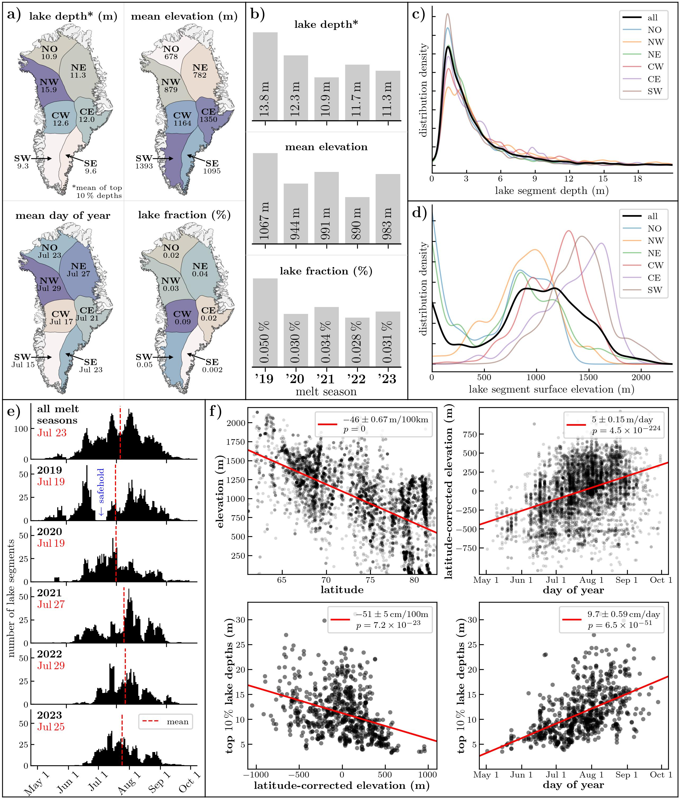
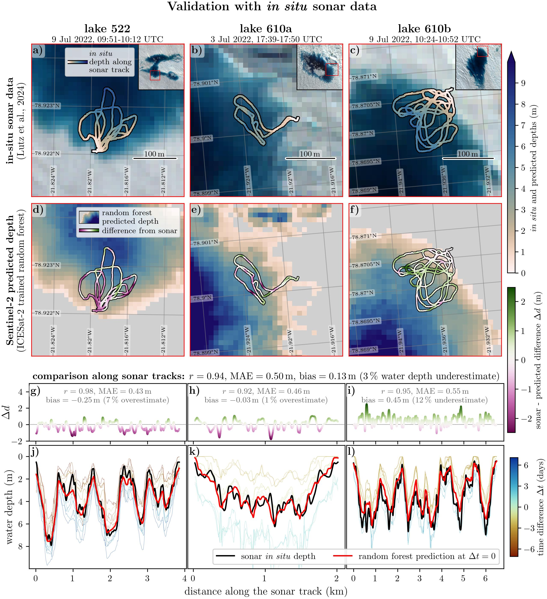
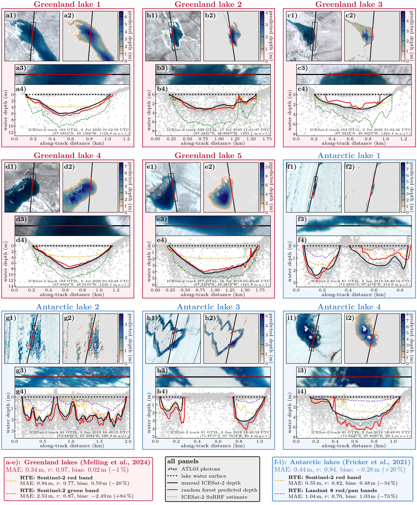

# This is work in progress

---

Map and examples of icesat-2 depth segments from FLUID/SuRRF:

**Figure 1. The ICESat-2 supraglacial lake depth dataset.** Center map: Locations of all ICESat-2 lake depth segments extracted from ATL03 data across the Greenland Ice Sheet from 2019 to 2023, using the FLUID/SuRRF framework. Dots representing lake segment locations are colored by depth, with the top quartile of maximum depth among each segment's 30-nearest neighbors used as a locally averaged measure. The map is divided into seven sub-regions, defined by the IMBIE basins. ICESat-2 reference ground tracks are shown to illustrate that ICESat-2 coverage increases with latitude. Side panels a-t: Examples of individual ICESat-2 lake depth segments extracted by FLUID/SuRRF. Left: Segment ground tracks over concurrent Sentinel-2 imagery. Right: ATL03 photon locations (black dots) with SuRRF fits to the lake surface (blue line) and lakebed (red line, shown where the bathymetry confidence score exceeds 0.3). Horizontal blue arrows indicate the along-track extent, and vertical red arrows show the maximum segment water depth. Numbers on the lower right represent the segment's quality score.

---

Distribution of the data (spatial, temporal, elevation, etc):

**Figure 2. Spatiotemporal variability and trends in the ICESat-2 supraglacial lake depth dataset.** a): Depth, elevation, timing and spatial density of supraglacial lakes by drainage basin. Lake depths are reported as the mean of the top 10 % of maximum along-track lake segment depths. b): Same statistics as in a), by melt season. c): Distribution of maximum along-track segment depths for the full dataset and by drainage basin. d): Distribution of lake segment surface elevations for the full dataset and by drainage basin. e): Histograms of the day of year for lake segment ICESat-2 overpasses, for the full dataset and by melt season. f): Estimates for the relationship between various parameters in the dataset. Values in the legends are the slopes of the linear fits (red line) to the data. Uncertainties are 95 % confidence intervals. Latitude-corrected elevations are the residuals from linearly regressing elevation on latitude. 

---

Figure for validation with *in situ* sonar data:

**Figure 3. Validation of random forest depth predictions with *in situ* sonar data.** a-c): *In situ* water depths from Lutz et al. (2024), plotted along the sonar track. Background images are median composites of Sentinel-2 around the *in situ* data acquisition date. d-f): Gridded water depths predicted by the random forest model. The sonar track overlays are colored by depth differences between sonar validation data and predicted depths. g-i) Differences between validation and predicted data plotted along the full distances of the sonar tracks, with performance statistics shown for each individual lake. j-l) Full depth profiles along the sonar tracks. Bold lines are *in situ* sonar measurements (black) and random forest estimates interpolated to the time of the sonar data acquisition (red). Thin lines are individual random forest depth predictions from Sentinel-2 scenes up to 7 days before and after the sonar data acquisition.

---

Comparison with the RTE method based on manually annotated ICESat-2 data:

**Figure 4. Comparison between random forest model predictions and RTE estimates for the depth of nine supraglacial lakes in Greenland and Antarctica.** a-e): ICESat-2 segments in Southwest Greenland with manual depths from Melling et al. (2024). RTE estimates are shown for Sentinel-2's red and green band, for values of tuneable parameters that have been commonly used in the literature. f-i): ICESat-2 segments on Amery Ice Shelf, Antarctica, with manual depths from Fricker et al. (2021). RTE estimates are shown for the average of Landsat 8's red and panchromatic bands and Sentinel-2's red band. Sub-panels 1): ICESat-2's ground tracks over Sentinel-2 imagery. Sub-panels 2): Gridded random forest depth predictions. Sub-panels 3): Zoomed-in imagery, rotated to match along-track ICESat-2 data. Sub-panels 4): Water depth estimates along the ICESat-2 ground tracks, plotted over ATL03 photon data. Performance statistics for random forest predictions on both ice sheets are reported in legend captions. Performance statistics for all RTE-based methods are reported in their respective legend entries.

# Supplementary

Sentinel-2 imagery showing the flooding of sonar validation lake 610a around the time of in-situ data acquisition. More imagery plots in the same style are included in [figures/sup/](figures/sup/) for the other validation/comparison lakes shown in Figs. 3 and 4. 

Sentinel-2 imagery showing the rapid drainage of "Greenland lake 3" ICESat-2 comparison lake segment from Melling et al. (2024) around the time of the ICESat-2 overpass.

ICESat-2 lake segment properties across the full dataset after fusion with Sentinel-2 data. 

ICESat-2 lake segment properties across the (high-quality) filtered dataset after fusion with Sentinel-2 data. Note the significantly improved NDWI match between ICESat-2 and Sentinel-2. 

Feature distributions across the training dataset used to train the random forest model.

10-fold cross validation statistics for the random forest model.

Number of ICESat-2 lake segments by individual IMBIE draininge (sub-) basins. This does not include basins with a total of 5 ICESat-2 lake segments or less. 

ICESat-2 lake segments included in the IMBIE drainage basins and segments that were added by including the GIMP ice mask. Note that the vast majority of lakes that are added in the GIMP ice mask are on floating ice tongues (the IMBIE basins include grounded ice only). A handful of other lakes are added where the IMBIE and GIMP ice mask do not agree, and where the GIMP ice mask merges nearby ice caps into the main Greenland ice sheet.

ICESat-2 Reference Ground Track (RGT) coverage over the Greenland Ice Sheet. 

